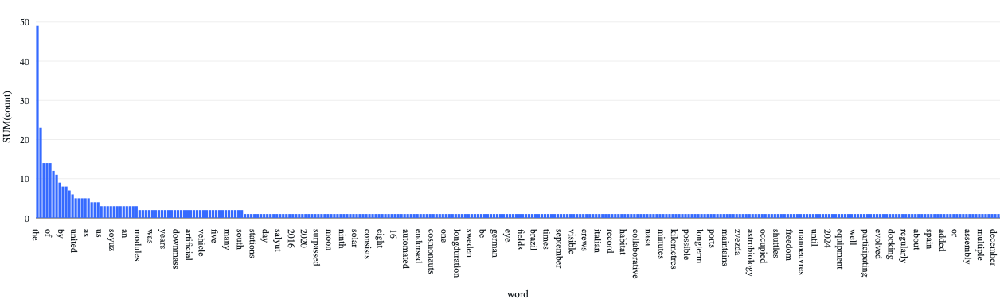

---
jupyter:
  application/vnd.databricks.v1+notebook:
    language: python
    notebookMetadata:
      pythonIndentUnit: 4
    notebookName: Word Count Notebook Using Pyspark
    widgets: {}
  nbformat: 4
  nbformat_minor: 0
---

<div class="cell markdown"
application/vnd.databricks.v1+cell="{&quot;cellMetadata&quot;:{},&quot;inputWidgets&quot;:{},&quot;nuid&quot;:&quot;5f8c4b57-6454-42a3-a400-12421285dff0&quot;,&quot;showTitle&quot;:false,&quot;title&quot;:&quot;&quot;}">

**Word Count TXT file using Pyspark** \|Data Engineer\|Dan HAI\| \| :-
\| :- \| \|Mode\|Schedule\| \|Idea \|Use pyspark functions to count
words and generate visualization \| \|Date\|2024-04-28\|

</div>

<div class="cell code" execution_count="0"
application/vnd.databricks.v1+cell="{&quot;cellMetadata&quot;:{&quot;byteLimit&quot;:2048000,&quot;rowLimit&quot;:10000},&quot;inputWidgets&quot;:{},&quot;nuid&quot;:&quot;72e3e107-3ae4-40d2-b108-56b64af26be8&quot;,&quot;showTitle&quot;:false,&quot;title&quot;:&quot;&quot;}">

``` python
from pyspark.sql.functions import lower, trim, regexp_replace, split, explode, col, desc
```

</div>

<div class="cell code" execution_count="0"
application/vnd.databricks.v1+cell="{&quot;cellMetadata&quot;:{&quot;byteLimit&quot;:2048000,&quot;rowLimit&quot;:10000},&quot;inputWidgets&quot;:{},&quot;nuid&quot;:&quot;0dd6da29-d560-470c-89aa-c3c431580a24&quot;,&quot;showTitle&quot;:false,&quot;title&quot;:&quot;&quot;}">

``` python
def removePunctuation(column):
    column = lower(trim(regexp_replace(column, r'[^A-Za-z0-9\s]', '')))
    return column
```

</div>

<div class="cell code" execution_count="0"
application/vnd.databricks.v1+cell="{&quot;cellMetadata&quot;:{&quot;byteLimit&quot;:2048000,&quot;rowLimit&quot;:10000},&quot;inputWidgets&quot;:{},&quot;nuid&quot;:&quot;1b461737-e143-4df0-a031-72b6367e5b50&quot;,&quot;showTitle&quot;:false,&quot;title&quot;:&quot;&quot;}">

``` python
fileName = "dbfs:/FileStore/tables/Space.txt"
```

</div>

<div class="cell code" execution_count="0"
application/vnd.databricks.v1+cell="{&quot;cellMetadata&quot;:{&quot;byteLimit&quot;:2048000,&quot;rowLimit&quot;:10000},&quot;inputWidgets&quot;:{},&quot;nuid&quot;:&quot;5a107a20-9ccf-4287-9075-257c2bd0b1ab&quot;,&quot;showTitle&quot;:false,&quot;title&quot;:&quot;&quot;}">

``` python
spaceDF= spark.read.text(fileName).select(removePunctuation(col('value')).alias('word'))
```

</div>

<div class="cell code" execution_count="0"
application/vnd.databricks.v1+cell="{&quot;cellMetadata&quot;:{&quot;byteLimit&quot;:2048000,&quot;rowLimit&quot;:10000},&quot;inputWidgets&quot;:{},&quot;nuid&quot;:&quot;a45090bc-d39a-4c9c-84e5-f817b8a84170&quot;,&quot;showTitle&quot;:false,&quot;title&quot;:&quot;&quot;}">

``` python
display(spaceDF)
```

<div class="output display_data">

<div class='table-result-container'><table class='table-result'><thead style='background-color: white'><tr><th>word</th></tr></thead><tbody><tr><td>the international space station iss is a modular space station habitable artificial satellite in low earth orbit</td></tr><tr><td>the iss programme is a multinational collaborative project between five participating space agencies nasa united states roscosmos russia jaxa japan esa europe and csa canada</td></tr><tr><td>the ownership and use of the space station is established by intergovernmental treaties and agreements</td></tr><tr><td>it evolved from the space station freedom proposal</td></tr><tr><td>the iss serves as a microgravity and space environment research laboratory in which scientific experiments are conducted in astrobiology astronomy meteorology physics and other fields</td></tr><tr><td>the station is suited for testing the spacecraft systems and equipment required for possible future longduration missions to the moon and mars</td></tr><tr><td>it is the largest artificial object in space and the largest satellite in low earth orbit regularly visible to the naked eye from earths surface</td></tr><tr><td>it maintains an orbit with an average altitude of 400 kilometres 250 mi by means of reboost manoeuvres using the engines of the zvezda service module or visiting spacecraft</td></tr><tr><td>the iss circles the earth in roughly 93 minutes completing about 16 orbits per day</td></tr><tr><td>the station is divided into two sections the russian orbital segment ros operated by russia and the united states orbital segment usos which is shared by many nations</td></tr><tr><td>roscosmos has endorsed the continued operation of iss through 2024 but had previously proposed using elements of the russian segment to construct a new russian space station called opsek</td></tr><tr><td>as of december 2018 the station is expected to operate until 2030</td></tr><tr><td>the first iss component was launched in 1998 with the first longterm residents arriving on 2 november 2000</td></tr><tr><td>since then the station has been continuously occupied for 19 years and 229 days</td></tr><tr><td>this is the longest continuous human presence in low earth orbit having surpassed the previous record of 9 years and 357 days held by the mir space station</td></tr><tr><td>the latest major pressurised module was fitted in 2011 with an experimental inflatable space habitat added in 2016</td></tr><tr><td>development and assembly of the station continues with several major new russian elements scheduled for launch starting in 2020</td></tr><tr><td>the iss consists of pressurised habitation modules structural trusses photovoltaic solar arrays thermal radiators docking ports experiment bays and robotic arms</td></tr><tr><td>major iss modules have been launched by russian proton and soyuz rockets and us space shuttles</td></tr><tr><td>the iss is the ninth space station to be inhabited by crews following the soviet and later russian salyut almaz and mir stations as well as skylab from the us</td></tr><tr><td>the station is serviced by a variety of visiting spacecraft the russian soyuz and progress the us dragon and cygnus the japanese hii transfer vehicle and formerly the european automated transfer vehicle</td></tr><tr><td>the dragon spacecraft allows the return of pressurised cargo to earth downmass which is used for example to repatriate scientific experiments for further analysis</td></tr><tr><td>the soyuz return capsule has minimal downmass capability next to the astronauts</td></tr><tr><td>as of september 2019 239 astronauts cosmonauts and space tourists from 20 different nations have visited the space station many of them multiple times</td></tr><tr><td>the united states sent 151 people russia sent 47 nine were japanese eight canadian five italian four french three german and one each from belgium brazil denmark kazakhstan malaysia the netherlands south africa south korea spain sweden the united arab emirates and the united kingdom</td></tr><tr><td></td></tr></tbody></table></div>

</div>

</div>

<div class="cell code" execution_count="0"
application/vnd.databricks.v1+cell="{&quot;cellMetadata&quot;:{&quot;byteLimit&quot;:2048000,&quot;rowLimit&quot;:10000},&quot;inputWidgets&quot;:{},&quot;nuid&quot;:&quot;5f409c40-f997-4f53-8c9b-64e928fd66dd&quot;,&quot;showTitle&quot;:false,&quot;title&quot;:&quot;&quot;}">

``` python
spaceDF.count()
```

<div class="output stream stdout">

    Out[7]: 26

</div>

</div>

<div class="cell code" execution_count="0"
application/vnd.databricks.v1+cell="{&quot;cellMetadata&quot;:{&quot;byteLimit&quot;:2048000,&quot;rowLimit&quot;:10000},&quot;inputWidgets&quot;:{},&quot;nuid&quot;:&quot;ac031e9d-d671-4518-8f04-2778d9137d34&quot;,&quot;showTitle&quot;:false,&quot;title&quot;:&quot;&quot;}">

``` python
df = spaceDF.select(split(col("word"), ' ', -1).alias('word'))
```

</div>

<div class="cell code" execution_count="0"
application/vnd.databricks.v1+cell="{&quot;cellMetadata&quot;:{&quot;byteLimit&quot;:2048000,&quot;rowLimit&quot;:10000},&quot;inputWidgets&quot;:{},&quot;nuid&quot;:&quot;7425a5a6-47af-4927-98c2-79c3e443960f&quot;,&quot;showTitle&quot;:false,&quot;title&quot;:&quot;&quot;}">

``` python
display(df)
```

<div class="output display_data">

<style scoped>
  .table-result-container {
    max-height: 300px;
    overflow: auto;
  }
  table, th, td {
    border: 1px solid black;
    border-collapse: collapse;
  }
  th, td {
    padding: 5px;
  }
  th {
    text-align: left;
  }
</style><div class='table-result-container'><table class='table-result'><thead style='background-color: white'><tr><th>word</th></tr></thead><tbody><tr><td>List(the, international, space, station, iss, is, a, modular, space, station, habitable, artificial, satellite, in, low, earth, orbit)</td></tr><tr><td>List(the, iss, programme, is, a, multinational, collaborative, project, between, five, participating, space, agencies, nasa, united, states, roscosmos, russia, jaxa, japan, esa, europe, and, csa, canada)</td></tr><tr><td>List(the, ownership, and, use, of, the, space, station, is, established, by, intergovernmental, treaties, and, agreements)</td></tr><tr><td>List(it, evolved, from, the, space, station, freedom, proposal)</td></tr><tr><td>List(the, iss, serves, as, a, microgravity, and, space, environment, research, laboratory, in, which, scientific, experiments, are, conducted, in, astrobiology, astronomy, meteorology, physics, and, other, fields)</td></tr><tr><td>List(the, station, is, suited, for, testing, the, spacecraft, systems, and, equipment, required, for, possible, future, longduration, missions, to, the, moon, and, mars)</td></tr><tr><td>List(it, is, the, largest, artificial, object, in, space, and, the, largest, satellite, in, low, earth, orbit, regularly, visible, to, the, naked, eye, from, earths, surface)</td></tr><tr><td>List(it, maintains, an, orbit, with, an, average, altitude, of, 400, kilometres, 250, mi, by, means, of, reboost, manoeuvres, using, the, engines, of, the, zvezda, service, module, or, visiting, spacecraft)</td></tr><tr><td>List(the, iss, circles, the, earth, in, roughly, 93, minutes, completing, about, 16, orbits, per, day)</td></tr><tr><td>List(the, station, is, divided, into, two, sections, the, russian, orbital, segment, ros, operated, by, russia, and, the, united, states, orbital, segment, usos, which, is, shared, by, many, nations)</td></tr><tr><td>List(roscosmos, has, endorsed, the, continued, operation, of, iss, through, 2024, but, had, previously, proposed, using, elements, of, the, russian, segment, to, construct, a, new, russian, space, station, called, opsek)</td></tr><tr><td>List(as, of, december, 2018, the, station, is, expected, to, operate, until, 2030)</td></tr><tr><td>List(the, first, iss, component, was, launched, in, 1998, with, the, first, longterm, residents, arriving, on, 2, november, 2000)</td></tr><tr><td>List(since, then, the, station, has, been, continuously, occupied, for, 19, years, and, 229, days)</td></tr><tr><td>List(this, is, the, longest, continuous, human, presence, in, low, earth, orbit, having, surpassed, the, previous, record, of, 9, years, and, 357, days, held, by, the, mir, space, station)</td></tr><tr><td>List(the, latest, major, pressurised, module, was, fitted, in, 2011, with, an, experimental, inflatable, space, habitat, added, in, 2016)</td></tr><tr><td>List(development, and, assembly, of, the, station, continues, with, several, major, new, russian, elements, scheduled, for, launch, starting, in, 2020)</td></tr><tr><td>List(the, iss, consists, of, pressurised, habitation, modules, structural, trusses, photovoltaic, solar, arrays, thermal, radiators, docking, ports, experiment, bays, and, robotic, arms)</td></tr><tr><td>List(major, iss, modules, have, been, launched, by, russian, proton, and, soyuz, rockets, and, us, space, shuttles)</td></tr><tr><td>List(the, iss, is, the, ninth, space, station, to, be, inhabited, by, crews, following, the, soviet, and, later, russian, salyut, almaz, and, mir, stations, as, well, as, skylab, from, the, us)</td></tr><tr><td>List(the, station, is, serviced, by, a, variety, of, visiting, spacecraft, the, russian, soyuz, and, progress, the, us, dragon, and, cygnus, the, japanese, hii, transfer, vehicle, and, formerly, the, european, automated, transfer, vehicle)</td></tr><tr><td>List(the, dragon, spacecraft, allows, the, return, of, pressurised, cargo, to, earth, downmass, which, is, used, for, example, to, repatriate, scientific, experiments, for, further, analysis)</td></tr><tr><td>List(the, soyuz, return, capsule, has, minimal, downmass, capability, next, to, the, astronauts)</td></tr><tr><td>List(as, of, september, 2019, 239, astronauts, cosmonauts, and, space, tourists, from, 20, different, nations, have, visited, the, space, station, many, of, them, multiple, times)</td></tr><tr><td>List(the, united, states, sent, 151, people, russia, sent, 47, nine, were, japanese, eight, canadian, five, italian, four, french, three, german, and, one, each, from, belgium, brazil, denmark, kazakhstan, malaysia, the, netherlands, south, africa, south, korea, spain, sweden, the, united, arab, emirates, and, the, united, kingdom)</td></tr><tr><td>List()</td></tr></tbody></table></div>

</div>

</div>

<div class="cell code" execution_count="0"
application/vnd.databricks.v1+cell="{&quot;cellMetadata&quot;:{&quot;byteLimit&quot;:2048000,&quot;rowLimit&quot;:10000},&quot;inputWidgets&quot;:{},&quot;nuid&quot;:&quot;49b5ffd1-aca0-4ede-9e09-7b56bc7c70a1&quot;,&quot;showTitle&quot;:false,&quot;title&quot;:&quot;&quot;}">

``` python
spaceWordsDF = df.select(explode(col('word')).alias('word'))
```

</div>

<div class="cell code" execution_count="0"
application/vnd.databricks.v1+cell="{&quot;cellMetadata&quot;:{&quot;byteLimit&quot;:2048000,&quot;rowLimit&quot;:10000},&quot;inputWidgets&quot;:{},&quot;nuid&quot;:&quot;36f3d26d-c6ac-4233-bb7e-ad5f15cc8d38&quot;,&quot;showTitle&quot;:false,&quot;title&quot;:&quot;&quot;}">

``` python
display(spaceWordsDF)
```

<div class="output display_data">

<div class='table-result-container'><table class='table-result'><thead style='background-color: white'><tr><th>word</th></tr></thead><tbody><tr><td>the</td></tr><tr><td>international</td></tr><tr><td>space</td></tr><tr><td>station</td></tr><tr><td>iss</td></tr><tr><td>is</td></tr><tr><td>a</td></tr><tr><td>modular</td></tr><tr><td>space</td></tr><tr><td>station</td></tr><tr><td>habitable</td></tr><tr><td>artificial</td></tr><tr><td>satellite</td></tr><tr><td>in</td></tr><tr><td>low</td></tr><tr><td>earth</td></tr><tr><td>orbit</td></tr><tr><td>the</td></tr><tr><td>iss</td></tr><tr><td>programme</td></tr><tr><td>is</td></tr><tr><td>a</td></tr><tr><td>multinational</td></tr><tr><td>collaborative</td></tr><tr><td>project</td></tr><tr><td>between</td></tr><tr><td>five</td></tr><tr><td>participating</td></tr><tr><td>space</td></tr><tr><td>agencies</td></tr><tr><td>nasa</td></tr><tr><td>united</td></tr><tr><td>states</td></tr><tr><td>roscosmos</td></tr><tr><td>russia</td></tr><tr><td>jaxa</td></tr><tr><td>japan</td></tr><tr><td>esa</td></tr><tr><td>europe</td></tr><tr><td>and</td></tr><tr><td>csa</td></tr><tr><td>canada</td></tr><tr><td>the</td></tr><tr><td>ownership</td></tr><tr><td>and</td></tr><tr><td>use</td></tr><tr><td>of</td></tr><tr><td>the</td></tr><tr><td>space</td></tr><tr><td>station</td></tr><tr><td>is</td></tr><tr><td>established</td></tr><tr><td>by</td></tr><tr><td>intergovernmental</td></tr><tr><td>treaties</td></tr><tr><td>and</td></tr><tr><td>agreements</td></tr><tr><td>it</td></tr><tr><td>evolved</td></tr><tr><td>from</td></tr><tr><td>the</td></tr><tr><td>space</td></tr><tr><td>station</td></tr><tr><td>freedom</td></tr><tr><td>proposal</td></tr><tr><td>the</td></tr><tr><td>iss</td></tr><tr><td>serves</td></tr><tr><td>as</td></tr><tr><td>a</td></tr><tr><td>microgravity</td></tr><tr><td>and</td></tr><tr><td>space</td></tr><tr><td>environment</td></tr><tr><td>research</td></tr><tr><td>laboratory</td></tr><tr><td>in</td></tr><tr><td>which</td></tr><tr><td>scientific</td></tr><tr><td>experiments</td></tr><tr><td>are</td></tr><tr><td>conducted</td></tr><tr><td>in</td></tr><tr><td>astrobiology</td></tr><tr><td>astronomy</td></tr><tr><td>meteorology</td></tr><tr><td>physics</td></tr><tr><td>and</td></tr><tr><td>other</td></tr><tr><td>fields</td></tr><tr><td>the</td></tr><tr><td>station</td></tr><tr><td>is</td></tr><tr><td>suited</td></tr><tr><td>for</td></tr><tr><td>testing</td></tr><tr><td>the</td></tr><tr><td>spacecraft</td></tr><tr><td>systems</td></tr><tr><td>and</td></tr><tr><td>equipment</td></tr><tr><td>required</td></tr><tr><td>for</td></tr><tr><td>possible</td></tr><tr><td>future</td></tr><tr><td>longduration</td></tr><tr><td>missions</td></tr><tr><td>to</td></tr><tr><td>the</td></tr><tr><td>moon</td></tr><tr><td>and</td></tr><tr><td>mars</td></tr><tr><td>it</td></tr><tr><td>is</td></tr><tr><td>the</td></tr><tr><td>largest</td></tr><tr><td>artificial</td></tr><tr><td>object</td></tr><tr><td>in</td></tr><tr><td>space</td></tr><tr><td>and</td></tr><tr><td>the</td></tr><tr><td>largest</td></tr><tr><td>satellite</td></tr><tr><td>in</td></tr><tr><td>low</td></tr><tr><td>earth</td></tr><tr><td>orbit</td></tr><tr><td>regularly</td></tr><tr><td>visible</td></tr><tr><td>to</td></tr><tr><td>the</td></tr><tr><td>naked</td></tr><tr><td>eye</td></tr><tr><td>from</td></tr><tr><td>earths</td></tr><tr><td>surface</td></tr><tr><td>it</td></tr><tr><td>maintains</td></tr><tr><td>an</td></tr><tr><td>orbit</td></tr><tr><td>with</td></tr><tr><td>an</td></tr><tr><td>average</td></tr><tr><td>altitude</td></tr><tr><td>of</td></tr><tr><td>400</td></tr><tr><td>kilometres</td></tr><tr><td>250</td></tr><tr><td>mi</td></tr><tr><td>by</td></tr><tr><td>means</td></tr><tr><td>of</td></tr><tr><td>reboost</td></tr><tr><td>manoeuvres</td></tr><tr><td>using</td></tr><tr><td>the</td></tr><tr><td>engines</td></tr><tr><td>of</td></tr><tr><td>the</td></tr><tr><td>zvezda</td></tr><tr><td>service</td></tr><tr><td>module</td></tr><tr><td>or</td></tr><tr><td>visiting</td></tr><tr><td>spacecraft</td></tr><tr><td>the</td></tr><tr><td>iss</td></tr><tr><td>circles</td></tr><tr><td>the</td></tr><tr><td>earth</td></tr><tr><td>in</td></tr><tr><td>roughly</td></tr><tr><td>93</td></tr><tr><td>minutes</td></tr><tr><td>completing</td></tr><tr><td>about</td></tr><tr><td>16</td></tr><tr><td>orbits</td></tr><tr><td>per</td></tr><tr><td>day</td></tr><tr><td>the</td></tr><tr><td>station</td></tr><tr><td>is</td></tr><tr><td>divided</td></tr><tr><td>into</td></tr><tr><td>two</td></tr><tr><td>sections</td></tr><tr><td>the</td></tr><tr><td>russian</td></tr><tr><td>orbital</td></tr><tr><td>segment</td></tr><tr><td>ros</td></tr><tr><td>operated</td></tr><tr><td>by</td></tr><tr><td>russia</td></tr><tr><td>and</td></tr><tr><td>the</td></tr><tr><td>united</td></tr><tr><td>states</td></tr><tr><td>orbital</td></tr><tr><td>segment</td></tr><tr><td>usos</td></tr><tr><td>which</td></tr><tr><td>is</td></tr><tr><td>shared</td></tr><tr><td>by</td></tr><tr><td>many</td></tr><tr><td>nations</td></tr><tr><td>roscosmos</td></tr><tr><td>has</td></tr><tr><td>endorsed</td></tr><tr><td>the</td></tr><tr><td>continued</td></tr><tr><td>operation</td></tr><tr><td>of</td></tr><tr><td>iss</td></tr><tr><td>through</td></tr><tr><td>2024</td></tr><tr><td>but</td></tr><tr><td>had</td></tr><tr><td>previously</td></tr><tr><td>proposed</td></tr><tr><td>using</td></tr><tr><td>elements</td></tr><tr><td>of</td></tr><tr><td>the</td></tr><tr><td>russian</td></tr><tr><td>segment</td></tr><tr><td>to</td></tr><tr><td>construct</td></tr><tr><td>a</td></tr><tr><td>new</td></tr><tr><td>russian</td></tr><tr><td>space</td></tr><tr><td>station</td></tr><tr><td>called</td></tr><tr><td>opsek</td></tr><tr><td>as</td></tr><tr><td>of</td></tr><tr><td>december</td></tr><tr><td>2018</td></tr><tr><td>the</td></tr><tr><td>station</td></tr><tr><td>is</td></tr><tr><td>expected</td></tr><tr><td>to</td></tr><tr><td>operate</td></tr><tr><td>until</td></tr><tr><td>2030</td></tr><tr><td>the</td></tr><tr><td>first</td></tr><tr><td>iss</td></tr><tr><td>component</td></tr><tr><td>was</td></tr><tr><td>launched</td></tr><tr><td>in</td></tr><tr><td>1998</td></tr><tr><td>with</td></tr><tr><td>the</td></tr><tr><td>first</td></tr><tr><td>longterm</td></tr><tr><td>residents</td></tr><tr><td>arriving</td></tr><tr><td>on</td></tr><tr><td>2</td></tr><tr><td>november</td></tr><tr><td>2000</td></tr><tr><td>since</td></tr><tr><td>then</td></tr><tr><td>the</td></tr><tr><td>station</td></tr><tr><td>has</td></tr><tr><td>been</td></tr><tr><td>continuously</td></tr><tr><td>occupied</td></tr><tr><td>for</td></tr><tr><td>19</td></tr><tr><td>years</td></tr><tr><td>and</td></tr><tr><td>229</td></tr><tr><td>days</td></tr><tr><td>this</td></tr><tr><td>is</td></tr><tr><td>the</td></tr><tr><td>longest</td></tr><tr><td>continuous</td></tr><tr><td>human</td></tr><tr><td>presence</td></tr><tr><td>in</td></tr><tr><td>low</td></tr><tr><td>earth</td></tr><tr><td>orbit</td></tr><tr><td>having</td></tr><tr><td>surpassed</td></tr><tr><td>the</td></tr><tr><td>previous</td></tr><tr><td>record</td></tr><tr><td>of</td></tr><tr><td>9</td></tr><tr><td>years</td></tr><tr><td>and</td></tr><tr><td>357</td></tr><tr><td>days</td></tr><tr><td>held</td></tr><tr><td>by</td></tr><tr><td>the</td></tr><tr><td>mir</td></tr><tr><td>space</td></tr><tr><td>station</td></tr><tr><td>the</td></tr><tr><td>latest</td></tr><tr><td>major</td></tr><tr><td>pressurised</td></tr><tr><td>module</td></tr><tr><td>was</td></tr><tr><td>fitted</td></tr><tr><td>in</td></tr><tr><td>2011</td></tr><tr><td>with</td></tr><tr><td>an</td></tr><tr><td>experimental</td></tr><tr><td>inflatable</td></tr><tr><td>space</td></tr><tr><td>habitat</td></tr><tr><td>added</td></tr><tr><td>in</td></tr><tr><td>2016</td></tr><tr><td>development</td></tr><tr><td>and</td></tr><tr><td>assembly</td></tr><tr><td>of</td></tr><tr><td>the</td></tr><tr><td>station</td></tr><tr><td>continues</td></tr><tr><td>with</td></tr><tr><td>several</td></tr><tr><td>major</td></tr><tr><td>new</td></tr><tr><td>russian</td></tr><tr><td>elements</td></tr><tr><td>scheduled</td></tr><tr><td>for</td></tr><tr><td>launch</td></tr><tr><td>starting</td></tr><tr><td>in</td></tr><tr><td>2020</td></tr><tr><td>the</td></tr><tr><td>iss</td></tr><tr><td>consists</td></tr><tr><td>of</td></tr><tr><td>pressurised</td></tr><tr><td>habitation</td></tr><tr><td>modules</td></tr><tr><td>structural</td></tr><tr><td>trusses</td></tr><tr><td>photovoltaic</td></tr><tr><td>solar</td></tr><tr><td>arrays</td></tr><tr><td>thermal</td></tr><tr><td>radiators</td></tr><tr><td>docking</td></tr><tr><td>ports</td></tr><tr><td>experiment</td></tr><tr><td>bays</td></tr><tr><td>and</td></tr><tr><td>robotic</td></tr><tr><td>arms</td></tr><tr><td>major</td></tr><tr><td>iss</td></tr><tr><td>modules</td></tr><tr><td>have</td></tr><tr><td>been</td></tr><tr><td>launched</td></tr><tr><td>by</td></tr><tr><td>russian</td></tr><tr><td>proton</td></tr><tr><td>and</td></tr><tr><td>soyuz</td></tr><tr><td>rockets</td></tr><tr><td>and</td></tr><tr><td>us</td></tr><tr><td>space</td></tr><tr><td>shuttles</td></tr><tr><td>the</td></tr><tr><td>iss</td></tr><tr><td>is</td></tr><tr><td>the</td></tr><tr><td>ninth</td></tr><tr><td>space</td></tr><tr><td>station</td></tr><tr><td>to</td></tr><tr><td>be</td></tr><tr><td>inhabited</td></tr><tr><td>by</td></tr><tr><td>crews</td></tr><tr><td>following</td></tr><tr><td>the</td></tr><tr><td>soviet</td></tr><tr><td>and</td></tr><tr><td>later</td></tr><tr><td>russian</td></tr><tr><td>salyut</td></tr><tr><td>almaz</td></tr><tr><td>and</td></tr><tr><td>mir</td></tr><tr><td>stations</td></tr><tr><td>as</td></tr><tr><td>well</td></tr><tr><td>as</td></tr><tr><td>skylab</td></tr><tr><td>from</td></tr><tr><td>the</td></tr><tr><td>us</td></tr><tr><td>the</td></tr><tr><td>station</td></tr><tr><td>is</td></tr><tr><td>serviced</td></tr><tr><td>by</td></tr><tr><td>a</td></tr><tr><td>variety</td></tr><tr><td>of</td></tr><tr><td>visiting</td></tr><tr><td>spacecraft</td></tr><tr><td>the</td></tr><tr><td>russian</td></tr><tr><td>soyuz</td></tr><tr><td>and</td></tr><tr><td>progress</td></tr><tr><td>the</td></tr><tr><td>us</td></tr><tr><td>dragon</td></tr><tr><td>and</td></tr><tr><td>cygnus</td></tr><tr><td>the</td></tr><tr><td>japanese</td></tr><tr><td>hii</td></tr><tr><td>transfer</td></tr><tr><td>vehicle</td></tr><tr><td>and</td></tr><tr><td>formerly</td></tr><tr><td>the</td></tr><tr><td>european</td></tr><tr><td>automated</td></tr><tr><td>transfer</td></tr><tr><td>vehicle</td></tr><tr><td>the</td></tr><tr><td>dragon</td></tr><tr><td>spacecraft</td></tr><tr><td>allows</td></tr><tr><td>the</td></tr><tr><td>return</td></tr><tr><td>of</td></tr><tr><td>pressurised</td></tr><tr><td>cargo</td></tr><tr><td>to</td></tr><tr><td>earth</td></tr><tr><td>downmass</td></tr><tr><td>which</td></tr><tr><td>is</td></tr><tr><td>used</td></tr><tr><td>for</td></tr><tr><td>example</td></tr><tr><td>to</td></tr><tr><td>repatriate</td></tr><tr><td>scientific</td></tr><tr><td>experiments</td></tr><tr><td>for</td></tr><tr><td>further</td></tr><tr><td>analysis</td></tr><tr><td>the</td></tr><tr><td>soyuz</td></tr><tr><td>return</td></tr><tr><td>capsule</td></tr><tr><td>has</td></tr><tr><td>minimal</td></tr><tr><td>downmass</td></tr><tr><td>capability</td></tr><tr><td>next</td></tr><tr><td>to</td></tr><tr><td>the</td></tr><tr><td>astronauts</td></tr><tr><td>as</td></tr><tr><td>of</td></tr><tr><td>september</td></tr><tr><td>2019</td></tr><tr><td>239</td></tr><tr><td>astronauts</td></tr><tr><td>cosmonauts</td></tr><tr><td>and</td></tr><tr><td>space</td></tr><tr><td>tourists</td></tr><tr><td>from</td></tr><tr><td>20</td></tr><tr><td>different</td></tr><tr><td>nations</td></tr><tr><td>have</td></tr><tr><td>visited</td></tr><tr><td>the</td></tr><tr><td>space</td></tr><tr><td>station</td></tr><tr><td>many</td></tr><tr><td>of</td></tr><tr><td>them</td></tr><tr><td>multiple</td></tr><tr><td>times</td></tr><tr><td>the</td></tr><tr><td>united</td></tr><tr><td>states</td></tr><tr><td>sent</td></tr><tr><td>151</td></tr><tr><td>people</td></tr><tr><td>russia</td></tr><tr><td>sent</td></tr><tr><td>47</td></tr><tr><td>nine</td></tr><tr><td>were</td></tr><tr><td>japanese</td></tr><tr><td>eight</td></tr><tr><td>canadian</td></tr><tr><td>five</td></tr><tr><td>italian</td></tr><tr><td>four</td></tr><tr><td>french</td></tr><tr><td>three</td></tr><tr><td>german</td></tr><tr><td>and</td></tr><tr><td>one</td></tr><tr><td>each</td></tr><tr><td>from</td></tr><tr><td>belgium</td></tr><tr><td>brazil</td></tr><tr><td>denmark</td></tr><tr><td>kazakhstan</td></tr><tr><td>malaysia</td></tr><tr><td>the</td></tr><tr><td>netherlands</td></tr><tr><td>south</td></tr><tr><td>africa</td></tr><tr><td>south</td></tr><tr><td>korea</td></tr><tr><td>spain</td></tr><tr><td>sweden</td></tr><tr><td>the</td></tr><tr><td>united</td></tr><tr><td>arab</td></tr><tr><td>emirates</td></tr><tr><td>and</td></tr><tr><td>the</td></tr><tr><td>united</td></tr><tr><td>kingdom</td></tr><tr><td></td></tr></tbody></table></div>

</div>

</div>

<div class="cell code" execution_count="0"
application/vnd.databricks.v1+cell="{&quot;cellMetadata&quot;:{&quot;byteLimit&quot;:2048000,&quot;rowLimit&quot;:10000},&quot;inputWidgets&quot;:{},&quot;nuid&quot;:&quot;f86f7ea8-a2a8-402d-bbef-12cea6adec2e&quot;,&quot;showTitle&quot;:false,&quot;title&quot;:&quot;&quot;}">

``` python
test = spaceWordsDF_clean.groupBy(col('word')).count()
display(test)
```

<div class="output display_data">

<div class='table-result-container'><table class='table-result'><thead style='background-color: white'><tr><th>word</th><th>count</th></tr></thead><tbody><tr><td>photovoltaic</td><td>1</td></tr><tr><td>operation</td><td>1</td></tr><tr><td>launch</td><td>1</td></tr><tr><td>stations</td><td>1</td></tr><tr><td>meteorology</td><td>1</td></tr><tr><td>robotic</td><td>1</td></tr><tr><td>inhabited</td><td>1</td></tr><tr><td>day</td><td>1</td></tr><tr><td>used</td><td>1</td></tr><tr><td>astronomy</td><td>1</td></tr><tr><td>naked</td><td>1</td></tr><tr><td>salyut</td><td>1</td></tr><tr><td>space</td><td>14</td></tr><tr><td>csa</td><td>1</td></tr><tr><td>multinational</td><td>1</td></tr><tr><td>two</td><td>1</td></tr><tr><td>2016</td><td>1</td></tr><tr><td>us</td><td>3</td></tr><tr><td>component</td><td>1</td></tr><tr><td>orbit</td><td>4</td></tr><tr><td>microgravity</td><td>1</td></tr><tr><td>ros</td><td>1</td></tr><tr><td>2020</td><td>1</td></tr><tr><td>experimental</td><td>1</td></tr><tr><td>serves</td><td>1</td></tr><tr><td>trusses</td><td>1</td></tr><tr><td>surpassed</td><td>1</td></tr><tr><td>progress</td><td>1</td></tr><tr><td>kingdom</td><td>1</td></tr><tr><td>intergovernmental</td><td>1</td></tr><tr><td>moon</td><td>1</td></tr><tr><td>skylab</td><td>1</td></tr><tr><td>continued</td><td>1</td></tr><tr><td>starting</td><td>1</td></tr><tr><td>ninth</td><td>1</td></tr><tr><td>kazakhstan</td><td>1</td></tr><tr><td>low</td><td>3</td></tr><tr><td>treaties</td><td>1</td></tr><tr><td>modules</td><td>2</td></tr><tr><td>modular</td><td>1</td></tr><tr><td>russian</td><td>7</td></tr><tr><td>solar</td><td>1</td></tr><tr><td>previous</td><td>1</td></tr><tr><td>radiators</td><td>1</td></tr><tr><td>by</td><td>8</td></tr><tr><td>250</td><td>1</td></tr><tr><td>using</td><td>2</td></tr><tr><td>spacecraft</td><td>4</td></tr><tr><td>new</td><td>2</td></tr><tr><td>consists</td><td>1</td></tr><tr><td>2019</td><td>1</td></tr><tr><td>missions</td><td>1</td></tr><tr><td>variety</td><td>1</td></tr><tr><td>station</td><td>14</td></tr><tr><td>eight</td><td>1</td></tr><tr><td>launched</td><td>2</td></tr><tr><td>japan</td><td>1</td></tr><tr><td>research</td><td>1</td></tr><tr><td>required</td><td>1</td></tr><tr><td>16</td><td>1</td></tr><tr><td>tourists</td><td>1</td></tr><tr><td>visited</td><td>1</td></tr><tr><td>was</td><td>2</td></tr><tr><td>2000</td><td>1</td></tr><tr><td>automated</td><td>1</td></tr><tr><td>programme</td><td>1</td></tr><tr><td>for</td><td>6</td></tr><tr><td>construct</td><td>1</td></tr><tr><td>capsule</td><td>1</td></tr><tr><td>endorsed</td><td>1</td></tr><tr><td>47</td><td>1</td></tr><tr><td>per</td><td>1</td></tr><tr><td>mir</td><td>2</td></tr><tr><td>example</td><td>1</td></tr><tr><td>cosmonauts</td><td>1</td></tr><tr><td>four</td><td>1</td></tr><tr><td>surface</td><td>1</td></tr><tr><td>operated</td><td>1</td></tr><tr><td>one</td><td>1</td></tr><tr><td>in</td><td>11</td></tr><tr><td>suited</td><td>1</td></tr><tr><td>average</td><td>1</td></tr><tr><td>korea</td><td>1</td></tr><tr><td>longduration</td><td>1</td></tr><tr><td>earths</td><td>1</td></tr><tr><td>major</td><td>3</td></tr><tr><td>object</td><td>1</td></tr><tr><td>with</td><td>4</td></tr><tr><td>human</td><td>1</td></tr><tr><td>sweden</td><td>1</td></tr><tr><td>had</td><td>1</td></tr><tr><td>united</td><td>5</td></tr><tr><td>future</td><td>1</td></tr><tr><td>roughly</td><td>1</td></tr><tr><td>be</td><td>1</td></tr><tr><td>agreements</td><td>1</td></tr><tr><td>2018</td><td>1</td></tr><tr><td>days</td><td>2</td></tr><tr><td>continues</td><td>1</td></tr><tr><td>german</td><td>1</td></tr><tr><td>laboratory</td><td>1</td></tr><tr><td>divided</td><td>1</td></tr><tr><td>roscosmos</td><td>2</td></tr><tr><td>jaxa</td><td>1</td></tr><tr><td>segment</td><td>3</td></tr><tr><td>eye</td><td>1</td></tr><tr><td>circles</td><td>1</td></tr><tr><td>earth</td><td>5</td></tr><tr><td>years</td><td>2</td></tr><tr><td>later</td><td>1</td></tr><tr><td>europe</td><td>1</td></tr><tr><td>fields</td><td>1</td></tr><tr><td>french</td><td>1</td></tr><tr><td>emirates</td><td>1</td></tr><tr><td>project</td><td>1</td></tr><tr><td>brazil</td><td>1</td></tr><tr><td>inflatable</td><td>1</td></tr><tr><td>next</td><td>1</td></tr><tr><td>other</td><td>1</td></tr><tr><td>times</td><td>1</td></tr><tr><td>iss</td><td>9</td></tr><tr><td>operate</td><td>1</td></tr><tr><td>having</td><td>1</td></tr><tr><td>soyuz</td><td>3</td></tr><tr><td>netherlands</td><td>1</td></tr><tr><td>scientific</td><td>2</td></tr><tr><td>pressurised</td><td>3</td></tr><tr><td>september</td><td>1</td></tr><tr><td>allows</td><td>1</td></tr><tr><td>is</td><td>12</td></tr><tr><td>between</td><td>1</td></tr><tr><td>mars</td><td>1</td></tr><tr><td>visible</td><td>1</td></tr><tr><td>capability</td><td>1</td></tr><tr><td>on</td><td>1</td></tr><tr><td>229</td><td>1</td></tr><tr><td>crews</td><td>1</td></tr><tr><td>canadian</td><td>1</td></tr><tr><td>but</td><td>1</td></tr><tr><td>arrays</td><td>1</td></tr><tr><td>italian</td><td>1</td></tr><tr><td>19</td><td>1</td></tr><tr><td>proton</td><td>1</td></tr><tr><td>each</td><td>1</td></tr><tr><td>record</td><td>1</td></tr><tr><td>people</td><td>1</td></tr><tr><td>formerly</td><td>1</td></tr><tr><td>canada</td><td>1</td></tr><tr><td>habitat</td><td>1</td></tr><tr><td>use</td><td>1</td></tr><tr><td>testing</td><td>1</td></tr><tr><td>different</td><td>1</td></tr><tr><td>collaborative</td><td>1</td></tr><tr><td>proposal</td><td>1</td></tr><tr><td>into</td><td>1</td></tr><tr><td>following</td><td>1</td></tr><tr><td>nasa</td><td>1</td></tr><tr><td>shared</td><td>1</td></tr><tr><td>2011</td><td>1</td></tr><tr><td>it</td><td>3</td></tr><tr><td>arriving</td><td>1</td></tr><tr><td>minutes</td><td>1</td></tr><tr><td>residents</td><td>1</td></tr><tr><td>analysis</td><td>1</td></tr><tr><td>93</td><td>1</td></tr><tr><td>kilometres</td><td>1</td></tr><tr><td>latest</td><td>1</td></tr><tr><td>fitted</td><td>1</td></tr><tr><td>conducted</td><td>1</td></tr><tr><td>module</td><td>2</td></tr><tr><td>have</td><td>2</td></tr><tr><td>possible</td><td>1</td></tr><tr><td>established</td><td>1</td></tr><tr><td>states</td><td>3</td></tr><tr><td>the</td><td>49</td></tr><tr><td>completing</td><td>1</td></tr><tr><td>habitation</td><td>1</td></tr><tr><td>longterm</td><td>1</td></tr><tr><td>minimal</td><td>1</td></tr><tr><td>reboost</td><td>1</td></tr><tr><td>cygnus</td><td>1</td></tr><tr><td>ports</td><td>1</td></tr><tr><td>downmass</td><td>2</td></tr><tr><td>sent</td><td>2</td></tr><tr><td>esa</td><td>1</td></tr><tr><td>return</td><td>2</td></tr><tr><td>dragon</td><td>2</td></tr><tr><td>from</td><td>5</td></tr><tr><td>them</td><td>1</td></tr><tr><td>africa</td><td>1</td></tr><tr><td>maintains</td><td>1</td></tr><tr><td>almaz</td><td>1</td></tr><tr><td>bays</td><td>1</td></tr><tr><td>nine</td><td>1</td></tr><tr><td>zvezda</td><td>1</td></tr><tr><td>further</td><td>1</td></tr><tr><td>habitable</td><td>1</td></tr><tr><td>arms</td><td>1</td></tr><tr><td>astrobiology</td><td>1</td></tr><tr><td>artificial</td><td>2</td></tr><tr><td>cargo</td><td>1</td></tr><tr><td>239</td><td>1</td></tr><tr><td>and</td><td>23</td></tr><tr><td>presence</td><td>1</td></tr><tr><td>been</td><td>2</td></tr><tr><td>occupied</td><td>1</td></tr><tr><td>three</td><td>1</td></tr><tr><td>proposed</td><td>1</td></tr><tr><td>november</td><td>1</td></tr><tr><td>shuttles</td><td>1</td></tr><tr><td>are</td><td>1</td></tr><tr><td>usos</td><td>1</td></tr><tr><td>thermal</td><td>1</td></tr><tr><td>freedom</td><td>1</td></tr><tr><td>orbits</td><td>1</td></tr><tr><td>9</td><td>1</td></tr><tr><td>soviet</td><td>1</td></tr><tr><td>manoeuvres</td><td>1</td></tr><tr><td>hii</td><td>1</td></tr><tr><td>of</td><td>14</td></tr><tr><td>through</td><td>1</td></tr><tr><td>japanese</td><td>2</td></tr><tr><td>opsek</td><td>1</td></tr><tr><td>until</td><td>1</td></tr><tr><td>satellite</td><td>2</td></tr><tr><td>systems</td><td>1</td></tr><tr><td>20</td><td>1</td></tr><tr><td>several</td><td>1</td></tr><tr><td>2024</td><td>1</td></tr><tr><td>experiment</td><td>1</td></tr><tr><td>longest</td><td>1</td></tr><tr><td>357</td><td>1</td></tr><tr><td>an</td><td>3</td></tr><tr><td>equipment</td><td>1</td></tr><tr><td>service</td><td>1</td></tr><tr><td>arab</td><td>1</td></tr><tr><td>development</td><td>1</td></tr><tr><td>russia</td><td>3</td></tr><tr><td>well</td><td>1</td></tr><tr><td>malaysia</td><td>1</td></tr><tr><td>2030</td><td>1</td></tr><tr><td>vehicle</td><td>2</td></tr><tr><td>ownership</td><td>1</td></tr><tr><td>participating</td><td>1</td></tr><tr><td>structural</td><td>1</td></tr><tr><td>were</td><td>1</td></tr><tr><td>denmark</td><td>1</td></tr><tr><td>evolved</td><td>1</td></tr><tr><td>largest</td><td>2</td></tr><tr><td>previously</td><td>1</td></tr><tr><td>1998</td><td>1</td></tr><tr><td>mi</td><td>1</td></tr><tr><td>docking</td><td>1</td></tr><tr><td>experiments</td><td>2</td></tr><tr><td>astronauts</td><td>2</td></tr><tr><td>400</td><td>1</td></tr><tr><td>continuously</td><td>1</td></tr><tr><td>continuous</td><td>1</td></tr><tr><td>a</td><td>5</td></tr><tr><td>regularly</td><td>1</td></tr><tr><td>rockets</td><td>1</td></tr><tr><td>european</td><td>1</td></tr><tr><td>as</td><td>5</td></tr><tr><td>this</td><td>1</td></tr><tr><td>five</td><td>2</td></tr><tr><td>about</td><td>1</td></tr><tr><td>repatriate</td><td>1</td></tr><tr><td>engines</td><td>1</td></tr><tr><td>agencies</td><td>1</td></tr><tr><td>has</td><td>3</td></tr><tr><td>spain</td><td>1</td></tr><tr><td>environment</td><td>1</td></tr><tr><td>then</td><td>1</td></tr><tr><td>first</td><td>2</td></tr><tr><td>151</td><td>1</td></tr><tr><td>added</td><td>1</td></tr><tr><td>since</td><td>1</td></tr><tr><td>physics</td><td>1</td></tr><tr><td>altitude</td><td>1</td></tr><tr><td>visiting</td><td>2</td></tr><tr><td>transfer</td><td>2</td></tr><tr><td>or</td><td>1</td></tr><tr><td>scheduled</td><td>1</td></tr><tr><td>belgium</td><td>1</td></tr><tr><td>to</td><td>8</td></tr><tr><td>many</td><td>2</td></tr><tr><td>2</td><td>1</td></tr><tr><td>assembly</td><td>1</td></tr><tr><td>serviced</td><td>1</td></tr><tr><td>international</td><td>1</td></tr><tr><td>expected</td><td>1</td></tr><tr><td>multiple</td><td>1</td></tr><tr><td>means</td><td>1</td></tr><tr><td>sections</td><td>1</td></tr><tr><td>orbital</td><td>2</td></tr><tr><td>nations</td><td>2</td></tr><tr><td>elements</td><td>2</td></tr><tr><td>which</td><td>3</td></tr><tr><td>called</td><td>1</td></tr><tr><td>december</td><td>1</td></tr><tr><td>held</td><td>1</td></tr><tr><td>south</td><td>2</td></tr></tbody></table></div>

</div>

</div>

<div class="cell code" execution_count="0"
application/vnd.databricks.v1+cell="{&quot;cellMetadata&quot;:{&quot;byteLimit&quot;:2048000,&quot;rowLimit&quot;:10000},&quot;inputWidgets&quot;:{},&quot;nuid&quot;:&quot;82b4d5be-4de4-4009-99b0-f1cf9cf13849&quot;,&quot;showTitle&quot;:false,&quot;title&quot;:&quot;&quot;}">

``` python
spaceWordsDF_clean = spaceWordsDF.where(col("word") != "")
display(spaceWordsDF_clean)
```

<div class="output display_data">

<div class='table-result-container'><table class='table-result'><thead style='background-color: white'><tr><th>word</th></tr></thead><tbody><tr><td>the</td></tr><tr><td>international</td></tr><tr><td>space</td></tr><tr><td>station</td></tr><tr><td>iss</td></tr><tr><td>is</td></tr><tr><td>a</td></tr><tr><td>modular</td></tr><tr><td>space</td></tr><tr><td>station</td></tr><tr><td>habitable</td></tr><tr><td>artificial</td></tr><tr><td>satellite</td></tr><tr><td>in</td></tr><tr><td>low</td></tr><tr><td>earth</td></tr><tr><td>orbit</td></tr><tr><td>the</td></tr><tr><td>iss</td></tr><tr><td>programme</td></tr><tr><td>is</td></tr><tr><td>a</td></tr><tr><td>multinational</td></tr><tr><td>collaborative</td></tr><tr><td>project</td></tr><tr><td>between</td></tr><tr><td>five</td></tr><tr><td>participating</td></tr><tr><td>space</td></tr><tr><td>agencies</td></tr><tr><td>nasa</td></tr><tr><td>united</td></tr><tr><td>states</td></tr><tr><td>roscosmos</td></tr><tr><td>russia</td></tr><tr><td>jaxa</td></tr><tr><td>japan</td></tr><tr><td>esa</td></tr><tr><td>europe</td></tr><tr><td>and</td></tr><tr><td>csa</td></tr><tr><td>canada</td></tr><tr><td>the</td></tr><tr><td>ownership</td></tr><tr><td>and</td></tr><tr><td>use</td></tr><tr><td>of</td></tr><tr><td>the</td></tr><tr><td>space</td></tr><tr><td>station</td></tr><tr><td>is</td></tr><tr><td>established</td></tr><tr><td>by</td></tr><tr><td>intergovernmental</td></tr><tr><td>treaties</td></tr><tr><td>and</td></tr><tr><td>agreements</td></tr><tr><td>it</td></tr><tr><td>evolved</td></tr><tr><td>from</td></tr><tr><td>the</td></tr><tr><td>space</td></tr><tr><td>station</td></tr><tr><td>freedom</td></tr><tr><td>proposal</td></tr><tr><td>the</td></tr><tr><td>iss</td></tr><tr><td>serves</td></tr><tr><td>as</td></tr><tr><td>a</td></tr><tr><td>microgravity</td></tr><tr><td>and</td></tr><tr><td>space</td></tr><tr><td>environment</td></tr><tr><td>research</td></tr><tr><td>laboratory</td></tr><tr><td>in</td></tr><tr><td>which</td></tr><tr><td>scientific</td></tr><tr><td>experiments</td></tr><tr><td>are</td></tr><tr><td>conducted</td></tr><tr><td>in</td></tr><tr><td>astrobiology</td></tr><tr><td>astronomy</td></tr><tr><td>meteorology</td></tr><tr><td>physics</td></tr><tr><td>and</td></tr><tr><td>other</td></tr><tr><td>fields</td></tr><tr><td>the</td></tr><tr><td>station</td></tr><tr><td>is</td></tr><tr><td>suited</td></tr><tr><td>for</td></tr><tr><td>testing</td></tr><tr><td>the</td></tr><tr><td>spacecraft</td></tr><tr><td>systems</td></tr><tr><td>and</td></tr><tr><td>equipment</td></tr><tr><td>required</td></tr><tr><td>for</td></tr><tr><td>possible</td></tr><tr><td>future</td></tr><tr><td>longduration</td></tr><tr><td>missions</td></tr><tr><td>to</td></tr><tr><td>the</td></tr><tr><td>moon</td></tr><tr><td>and</td></tr><tr><td>mars</td></tr><tr><td>it</td></tr><tr><td>is</td></tr><tr><td>the</td></tr><tr><td>largest</td></tr><tr><td>artificial</td></tr><tr><td>object</td></tr><tr><td>in</td></tr><tr><td>space</td></tr><tr><td>and</td></tr><tr><td>the</td></tr><tr><td>largest</td></tr><tr><td>satellite</td></tr><tr><td>in</td></tr><tr><td>low</td></tr><tr><td>earth</td></tr><tr><td>orbit</td></tr><tr><td>regularly</td></tr><tr><td>visible</td></tr><tr><td>to</td></tr><tr><td>the</td></tr><tr><td>naked</td></tr><tr><td>eye</td></tr><tr><td>from</td></tr><tr><td>earths</td></tr><tr><td>surface</td></tr><tr><td>it</td></tr><tr><td>maintains</td></tr><tr><td>an</td></tr><tr><td>orbit</td></tr><tr><td>with</td></tr><tr><td>an</td></tr><tr><td>average</td></tr><tr><td>altitude</td></tr><tr><td>of</td></tr><tr><td>400</td></tr><tr><td>kilometres</td></tr><tr><td>250</td></tr><tr><td>mi</td></tr><tr><td>by</td></tr><tr><td>means</td></tr><tr><td>of</td></tr><tr><td>reboost</td></tr><tr><td>manoeuvres</td></tr><tr><td>using</td></tr><tr><td>the</td></tr><tr><td>engines</td></tr><tr><td>of</td></tr><tr><td>the</td></tr><tr><td>zvezda</td></tr><tr><td>service</td></tr><tr><td>module</td></tr><tr><td>or</td></tr><tr><td>visiting</td></tr><tr><td>spacecraft</td></tr><tr><td>the</td></tr><tr><td>iss</td></tr><tr><td>circles</td></tr><tr><td>the</td></tr><tr><td>earth</td></tr><tr><td>in</td></tr><tr><td>roughly</td></tr><tr><td>93</td></tr><tr><td>minutes</td></tr><tr><td>completing</td></tr><tr><td>about</td></tr><tr><td>16</td></tr><tr><td>orbits</td></tr><tr><td>per</td></tr><tr><td>day</td></tr><tr><td>the</td></tr><tr><td>station</td></tr><tr><td>is</td></tr><tr><td>divided</td></tr><tr><td>into</td></tr><tr><td>two</td></tr><tr><td>sections</td></tr><tr><td>the</td></tr><tr><td>russian</td></tr><tr><td>orbital</td></tr><tr><td>segment</td></tr><tr><td>ros</td></tr><tr><td>operated</td></tr><tr><td>by</td></tr><tr><td>russia</td></tr><tr><td>and</td></tr><tr><td>the</td></tr><tr><td>united</td></tr><tr><td>states</td></tr><tr><td>orbital</td></tr><tr><td>segment</td></tr><tr><td>usos</td></tr><tr><td>which</td></tr><tr><td>is</td></tr><tr><td>shared</td></tr><tr><td>by</td></tr><tr><td>many</td></tr><tr><td>nations</td></tr><tr><td>roscosmos</td></tr><tr><td>has</td></tr><tr><td>endorsed</td></tr><tr><td>the</td></tr><tr><td>continued</td></tr><tr><td>operation</td></tr><tr><td>of</td></tr><tr><td>iss</td></tr><tr><td>through</td></tr><tr><td>2024</td></tr><tr><td>but</td></tr><tr><td>had</td></tr><tr><td>previously</td></tr><tr><td>proposed</td></tr><tr><td>using</td></tr><tr><td>elements</td></tr><tr><td>of</td></tr><tr><td>the</td></tr><tr><td>russian</td></tr><tr><td>segment</td></tr><tr><td>to</td></tr><tr><td>construct</td></tr><tr><td>a</td></tr><tr><td>new</td></tr><tr><td>russian</td></tr><tr><td>space</td></tr><tr><td>station</td></tr><tr><td>called</td></tr><tr><td>opsek</td></tr><tr><td>as</td></tr><tr><td>of</td></tr><tr><td>december</td></tr><tr><td>2018</td></tr><tr><td>the</td></tr><tr><td>station</td></tr><tr><td>is</td></tr><tr><td>expected</td></tr><tr><td>to</td></tr><tr><td>operate</td></tr><tr><td>until</td></tr><tr><td>2030</td></tr><tr><td>the</td></tr><tr><td>first</td></tr><tr><td>iss</td></tr><tr><td>component</td></tr><tr><td>was</td></tr><tr><td>launched</td></tr><tr><td>in</td></tr><tr><td>1998</td></tr><tr><td>with</td></tr><tr><td>the</td></tr><tr><td>first</td></tr><tr><td>longterm</td></tr><tr><td>residents</td></tr><tr><td>arriving</td></tr><tr><td>on</td></tr><tr><td>2</td></tr><tr><td>november</td></tr><tr><td>2000</td></tr><tr><td>since</td></tr><tr><td>then</td></tr><tr><td>the</td></tr><tr><td>station</td></tr><tr><td>has</td></tr><tr><td>been</td></tr><tr><td>continuously</td></tr><tr><td>occupied</td></tr><tr><td>for</td></tr><tr><td>19</td></tr><tr><td>years</td></tr><tr><td>and</td></tr><tr><td>229</td></tr><tr><td>days</td></tr><tr><td>this</td></tr><tr><td>is</td></tr><tr><td>the</td></tr><tr><td>longest</td></tr><tr><td>continuous</td></tr><tr><td>human</td></tr><tr><td>presence</td></tr><tr><td>in</td></tr><tr><td>low</td></tr><tr><td>earth</td></tr><tr><td>orbit</td></tr><tr><td>having</td></tr><tr><td>surpassed</td></tr><tr><td>the</td></tr><tr><td>previous</td></tr><tr><td>record</td></tr><tr><td>of</td></tr><tr><td>9</td></tr><tr><td>years</td></tr><tr><td>and</td></tr><tr><td>357</td></tr><tr><td>days</td></tr><tr><td>held</td></tr><tr><td>by</td></tr><tr><td>the</td></tr><tr><td>mir</td></tr><tr><td>space</td></tr><tr><td>station</td></tr><tr><td>the</td></tr><tr><td>latest</td></tr><tr><td>major</td></tr><tr><td>pressurised</td></tr><tr><td>module</td></tr><tr><td>was</td></tr><tr><td>fitted</td></tr><tr><td>in</td></tr><tr><td>2011</td></tr><tr><td>with</td></tr><tr><td>an</td></tr><tr><td>experimental</td></tr><tr><td>inflatable</td></tr><tr><td>space</td></tr><tr><td>habitat</td></tr><tr><td>added</td></tr><tr><td>in</td></tr><tr><td>2016</td></tr><tr><td>development</td></tr><tr><td>and</td></tr><tr><td>assembly</td></tr><tr><td>of</td></tr><tr><td>the</td></tr><tr><td>station</td></tr><tr><td>continues</td></tr><tr><td>with</td></tr><tr><td>several</td></tr><tr><td>major</td></tr><tr><td>new</td></tr><tr><td>russian</td></tr><tr><td>elements</td></tr><tr><td>scheduled</td></tr><tr><td>for</td></tr><tr><td>launch</td></tr><tr><td>starting</td></tr><tr><td>in</td></tr><tr><td>2020</td></tr><tr><td>the</td></tr><tr><td>iss</td></tr><tr><td>consists</td></tr><tr><td>of</td></tr><tr><td>pressurised</td></tr><tr><td>habitation</td></tr><tr><td>modules</td></tr><tr><td>structural</td></tr><tr><td>trusses</td></tr><tr><td>photovoltaic</td></tr><tr><td>solar</td></tr><tr><td>arrays</td></tr><tr><td>thermal</td></tr><tr><td>radiators</td></tr><tr><td>docking</td></tr><tr><td>ports</td></tr><tr><td>experiment</td></tr><tr><td>bays</td></tr><tr><td>and</td></tr><tr><td>robotic</td></tr><tr><td>arms</td></tr><tr><td>major</td></tr><tr><td>iss</td></tr><tr><td>modules</td></tr><tr><td>have</td></tr><tr><td>been</td></tr><tr><td>launched</td></tr><tr><td>by</td></tr><tr><td>russian</td></tr><tr><td>proton</td></tr><tr><td>and</td></tr><tr><td>soyuz</td></tr><tr><td>rockets</td></tr><tr><td>and</td></tr><tr><td>us</td></tr><tr><td>space</td></tr><tr><td>shuttles</td></tr><tr><td>the</td></tr><tr><td>iss</td></tr><tr><td>is</td></tr><tr><td>the</td></tr><tr><td>ninth</td></tr><tr><td>space</td></tr><tr><td>station</td></tr><tr><td>to</td></tr><tr><td>be</td></tr><tr><td>inhabited</td></tr><tr><td>by</td></tr><tr><td>crews</td></tr><tr><td>following</td></tr><tr><td>the</td></tr><tr><td>soviet</td></tr><tr><td>and</td></tr><tr><td>later</td></tr><tr><td>russian</td></tr><tr><td>salyut</td></tr><tr><td>almaz</td></tr><tr><td>and</td></tr><tr><td>mir</td></tr><tr><td>stations</td></tr><tr><td>as</td></tr><tr><td>well</td></tr><tr><td>as</td></tr><tr><td>skylab</td></tr><tr><td>from</td></tr><tr><td>the</td></tr><tr><td>us</td></tr><tr><td>the</td></tr><tr><td>station</td></tr><tr><td>is</td></tr><tr><td>serviced</td></tr><tr><td>by</td></tr><tr><td>a</td></tr><tr><td>variety</td></tr><tr><td>of</td></tr><tr><td>visiting</td></tr><tr><td>spacecraft</td></tr><tr><td>the</td></tr><tr><td>russian</td></tr><tr><td>soyuz</td></tr><tr><td>and</td></tr><tr><td>progress</td></tr><tr><td>the</td></tr><tr><td>us</td></tr><tr><td>dragon</td></tr><tr><td>and</td></tr><tr><td>cygnus</td></tr><tr><td>the</td></tr><tr><td>japanese</td></tr><tr><td>hii</td></tr><tr><td>transfer</td></tr><tr><td>vehicle</td></tr><tr><td>and</td></tr><tr><td>formerly</td></tr><tr><td>the</td></tr><tr><td>european</td></tr><tr><td>automated</td></tr><tr><td>transfer</td></tr><tr><td>vehicle</td></tr><tr><td>the</td></tr><tr><td>dragon</td></tr><tr><td>spacecraft</td></tr><tr><td>allows</td></tr><tr><td>the</td></tr><tr><td>return</td></tr><tr><td>of</td></tr><tr><td>pressurised</td></tr><tr><td>cargo</td></tr><tr><td>to</td></tr><tr><td>earth</td></tr><tr><td>downmass</td></tr><tr><td>which</td></tr><tr><td>is</td></tr><tr><td>used</td></tr><tr><td>for</td></tr><tr><td>example</td></tr><tr><td>to</td></tr><tr><td>repatriate</td></tr><tr><td>scientific</td></tr><tr><td>experiments</td></tr><tr><td>for</td></tr><tr><td>further</td></tr><tr><td>analysis</td></tr><tr><td>the</td></tr><tr><td>soyuz</td></tr><tr><td>return</td></tr><tr><td>capsule</td></tr><tr><td>has</td></tr><tr><td>minimal</td></tr><tr><td>downmass</td></tr><tr><td>capability</td></tr><tr><td>next</td></tr><tr><td>to</td></tr><tr><td>the</td></tr><tr><td>astronauts</td></tr><tr><td>as</td></tr><tr><td>of</td></tr><tr><td>september</td></tr><tr><td>2019</td></tr><tr><td>239</td></tr><tr><td>astronauts</td></tr><tr><td>cosmonauts</td></tr><tr><td>and</td></tr><tr><td>space</td></tr><tr><td>tourists</td></tr><tr><td>from</td></tr><tr><td>20</td></tr><tr><td>different</td></tr><tr><td>nations</td></tr><tr><td>have</td></tr><tr><td>visited</td></tr><tr><td>the</td></tr><tr><td>space</td></tr><tr><td>station</td></tr><tr><td>many</td></tr><tr><td>of</td></tr><tr><td>them</td></tr><tr><td>multiple</td></tr><tr><td>times</td></tr><tr><td>the</td></tr><tr><td>united</td></tr><tr><td>states</td></tr><tr><td>sent</td></tr><tr><td>151</td></tr><tr><td>people</td></tr><tr><td>russia</td></tr><tr><td>sent</td></tr><tr><td>47</td></tr><tr><td>nine</td></tr><tr><td>were</td></tr><tr><td>japanese</td></tr><tr><td>eight</td></tr><tr><td>canadian</td></tr><tr><td>five</td></tr><tr><td>italian</td></tr><tr><td>four</td></tr><tr><td>french</td></tr><tr><td>three</td></tr><tr><td>german</td></tr><tr><td>and</td></tr><tr><td>one</td></tr><tr><td>each</td></tr><tr><td>from</td></tr><tr><td>belgium</td></tr><tr><td>brazil</td></tr><tr><td>denmark</td></tr><tr><td>kazakhstan</td></tr><tr><td>malaysia</td></tr><tr><td>the</td></tr><tr><td>netherlands</td></tr><tr><td>south</td></tr><tr><td>africa</td></tr><tr><td>south</td></tr><tr><td>korea</td></tr><tr><td>spain</td></tr><tr><td>sweden</td></tr><tr><td>the</td></tr><tr><td>united</td></tr><tr><td>arab</td></tr><tr><td>emirates</td></tr><tr><td>and</td></tr><tr><td>the</td></tr><tr><td>united</td></tr><tr><td>kingdom</td></tr></tbody></table></div>

</div>

</div>

<div class="cell code" execution_count="0"
application/vnd.databricks.v1+cell="{&quot;cellMetadata&quot;:{&quot;byteLimit&quot;:2048000,&quot;rowLimit&quot;:10000},&quot;inputWidgets&quot;:{},&quot;nuid&quot;:&quot;24cdead4-4390-4542-96ba-e86474830ef7&quot;,&quot;showTitle&quot;:false,&quot;title&quot;:&quot;&quot;}">

``` python
def wordCount(word_list_df):
    count_word_list_df = word_list_df.groupBy(col('word')).count()
    return count_word_list_df
```

</div>

<div class="cell code" execution_count="0"
application/vnd.databricks.v1+cell="{&quot;cellMetadata&quot;:{&quot;byteLimit&quot;:2048000,&quot;rowLimit&quot;:10000},&quot;inputWidgets&quot;:{},&quot;nuid&quot;:&quot;c9c51ca5-9c63-4699-a264-c40816fcfc9e&quot;,&quot;showTitle&quot;:false,&quot;title&quot;:&quot;&quot;}">

``` python
top_word_count_df = wordCount(spaceWordsDF_clean)
```

<div class="output display_data">

<style scoped>
  .table-result-container {
    max-height: 300px;
    overflow: auto;
  }
  table, th, td {
    border: 1px solid black;
    border-collapse: collapse;
  }
  th, td {
    padding: 5px;
  }
  th {
    text-align: left;
  }
</style>

</div>

</div>

<div class="cell code" execution_count="0"
application/vnd.databricks.v1+cell="{&quot;cellMetadata&quot;:{&quot;byteLimit&quot;:2048000,&quot;rowLimit&quot;:10000},&quot;inputWidgets&quot;:{},&quot;nuid&quot;:&quot;6401878f-47a6-42c4-acd4-ec4e41da6e9a&quot;,&quot;showTitle&quot;:false,&quot;title&quot;:&quot;&quot;}">

``` python
final_top_word_count_df = top_word_count_df.orderBy(desc(col("count")))
display(final_top_word_count_df)
```

<div class="output display_data">

</div>

<div class="output display_data">

    

</div>

</div>

<div class="cell code" execution_count="0"
application/vnd.databricks.v1+cell="{&quot;cellMetadata&quot;:{},&quot;inputWidgets&quot;:{},&quot;nuid&quot;:&quot;c0c7fac4-bc31-4ecc-91fd-403a64669a53&quot;,&quot;showTitle&quot;:false,&quot;title&quot;:&quot;&quot;}">


``` python
```

</div>
